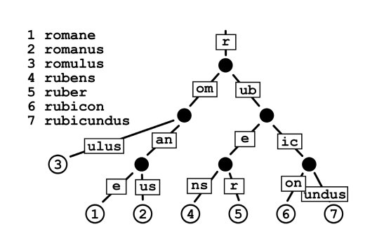

# merkle-patricia-trie

MPT in Go

## What is merkle-patricia-trie

Merkle trees and Patricia tries can be used in combination to create data structures in different ways depending on the aspect a protocol needs to optimize, such as speed,memory-efficiency, or code simplicity. A particularly interesting combination example is the MPT (merkle patricia trie) found in the Ethereum protocol. MPT also forms the basis of the architecture for the Hyperledger Indy distributed ledger.

All MPT nodes have a hash value called a key. Key-values are paths on the MPT just like the Radix tree image example.

MPT offers a cryptographically authenticated data structure that can be used to store key-value bindings in a fully deterministic way. This means that when you are provided with the same starting information, you will get the exact same trie with a O(log(n)) efficiency.

## Ref

[Ethereum white paper](https://ethereum.github.io/yellowpaper/paper.pdf)
[Merkle Patricia Trie(1)](https://medium.com/codechain/modified-merkle-patricia-trie-how-ethereum-saves-a-state-e6d7555078dd)
[Merkle Patricia Trie(2)](https://zhuanlan.zhihu.com/p/86643911)